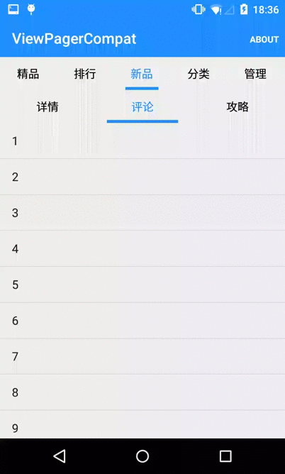

#ViewPagerCompat

ViewPagerCompat继承自ViewPager，解决了在API 13及其以下版本中，ViewPager嵌套的时候子ViewPager不能滑动的问题

Inherited from the ViewPager, solve API 13 and the following, when the ViewPager nested child ViewPager cannot slide



## Sample App
[Download it on Github](https://github.com/xiaopansky/ViewPagerCompat/raw/master/docs/sample.apk)


##Usage Guide
####1. 导入ViewPagerCompat（Import ViewPagerCompat to your project）

#####使用Gradle（Use Gradle）
``从JCenter仓库导入（Import from jcenter）``

```groovy
dependencies{
	compile 'me.xiaopan:viewpagercompat:1.1.0'
}
```

``离线模式（Offline work）``

首先到[releases](https://github.com/xiaopansky/ViewPagerCompat/releases)页面下载最新版的aar包（`这里以viewpagercompat-1.1.0.aar为例，具体请以你下载到的文件名称为准`），并放到你module的libs目录下

然后在你module的build.gradle文件中添加以下代码：
```groovy
repositories{
    flatDir(){
        dirs 'libs'
    }
}

dependencies{
    compile(name:'viewpagercompat-1.1.0', ext:'aar')
}
```
最后同步一下Gradle即可

#####使用Eclipse（Use Eclipse）
1. 首先到[releases](https://github.com/xiaopansky/ViewPagerCompat/releases)页面下载最新版的aar包（`这里以viewpagercompat-1.1.0.aar为例，具体请以你下载到的文件名称为准`）
2. 然后改后缀名为zip并解压
3. 接下来将classes.jar文件重命名为viewpagercompat-1.1.0.jar
4. 最后将viewpagercompat-1.1.0.jar拷贝到你的项目的libs目录下

####2. 配置最低版本（Configure min sdk version）
ViewPagerCompat最低兼容API v7

#####使用Gradle（Use Gradle）
在app/build.gradle文件文件中配置最低版本为7
```groovy
android {
	...

    defaultConfig {
        minSdkVersion 7
        ...
    }
}
```

#####使用Eclipse（Use Eclipse）
在AndroidManifest.xml文件中配置最低版本为7
```xml
<manifest
	...
	>
    <uses-sdk android:minSdkVersion="7"/>
    <application>
    ...
    </application>
</manifest>
```

###3. 使用
```xml
<me.xiaopan.vpc.ViewPagerCompat
    android:id="@+id/viewPager_main"
    android:layout_width="match_parent"
    android:layout_height="match_parent"/>
```

注意：
>* 只需父ViewPager使用ViewPagerCompat就可以实现ViewPager嵌套滑动
>* 必须使用最新版的support-v4库，因为旧版本的support-v4本身就存在兼容性问题

##License
```java
/*
* Copyright (C) 2014 Peng fei Pan <sky@xiaopan.me>
*
* Licensed under the Apache License, Version 2.0 (the "License");
* you may not use this file except in compliance with the License.
* You may obtain a copy of the License at
*
*   http://www.apache.org/licenses/LICENSE-2.0
*
* Unless required by applicable law or agreed to in writing, software
* distributed under the License is distributed on an "AS IS" BASIS,
* WITHOUT WARRANTIES OR CONDITIONS OF ANY KIND, either express or implied.
* See the License for the specific language governing permissions and
* limitations under the License.
*/
```
